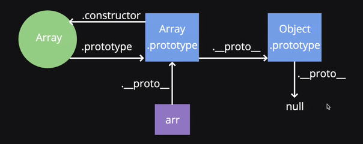

<h1>Prototypes</h1>

<h3>Objectives</h3>

<li>Understand what the prototype object is</li>
<li>Describe and diagram the relationship between _proto_, prototype, and constructor</li>
<li>Add methods and properties on the protoype object to write more efficient code</li>
<li>Explain the difference between adding methods and properties to the prototype versus the constructor function</li>

<h3>Contents</h3>

1. [Intro](#intro)
    1. [Review: The 'new' Keyword](#review)
    2. [A Small Diagram](#diagram)
    3. [Code](#code)
2. [Prototype](#prototype)
3. [Prototype Chain](#proto-chain)
4. [Refactoring](#refactor)
5. [Exercise](#exercise)
6. [Recap](#recap)


<hr>
<br>


<h2>Intro</h2>

<h3 id="review">Review: The 'new' Keyword</h3>

<h4>We previously used the new keyword to create objects from the constructor functions - let's recap what it does</h4>

<li>Creates an object out of thin air</li>
<li>Assigns the value of 'this' to be that object</li>
<li>Adds 'return this' to the end of the function</li>
<li>Creates a link (which we can access as _proto_) between the object created and the prototype property of the constructor function</li>
<br>

<h4>We're going to focus on the 4th point - let's see what that link looks like!</h4>

<h3 id="diagram">A Small Diagram</h3>

<li>Every constructor function has a property on it called 'prototype', which as an object</li>
<li>The prototype object has a property on it called 'constructor', which points back to the constructor function</li>
<li>Anytime an object is created using the 'new' keyword, a property called '_proto_' gets created, linking the object and the prototype property of the constructor function</li>

<h3 id="code">Code</h3>

Let's see that previous example in code

```javascript

// This is the constructor function

function Person(name) {
	this.name = name;
}

// This is an object created from the Person Constructor

const elie = new Person('Elie');
const colt = new Person('Colt');

// Since we used the new keyword, we have established a link 
// between the object and the prototype property.
// We can access that using _proto_

elie._proto_ === Person.prototype // true
colt._proto_ === Person.prototype // true

// The Person.prototype object also has a property called
// constructor which points back to the function

Person.prototype.constructor === Person; // true

```

<br>
<br>


<h2 id="prototype">Prototype</h2>

<h4>Where does the prototype property fit into all of this?</h4>
<h4>Remember, the prototype is shared among all objects created by that constructor</h4>


```javascript

// This is the constructor function

function Person(name) {
	this.name = name;
}

// This is an object created from the Person constructor

const elie = new Person('Elie');
const colt = new Person('Colt');

Person.prototype.isInstructor = true;

elie.isInstructor; // true
colt.isInstructor; // true

// How were we able to access properties on the prototype?

// _proto_ !

```
<br>
<br>


<h2 id="proto-chain">Prototype Chain</h2>

<h4>How does JavaScript find methods and properties?</h4>

<br>
<br>


<h2 id="refactor">Refactoring</h2>

<h4>Now that we know that objects created by the same constructor have a shared prototypem let's refactor some code</h4>


```javascript

function Person(name) {
	this.name = name;
	this.sayHi = function() {
		return `Hi ${this.name}`
	}
}

elie = new Person('Elie');
elie.sayHi(); // Hi Elie

// Now this code works, but it is inefficient.
// Every time we make an object using the new keyword we have to redefine this function
// but its the same for everyone! Let's put it on the prototype instead!

```
<h4>Can refactor to</h4>

```javascript

function Person(name) {
	this.name = name;
}

Person.prototype.sayHi = function() {
	return `Hi ${this.name}`
}

elie = new Person('Elie');
elie.sayHi(); // Hi Elie

```
<br>
<br>


<h2 id="exercise">Exercise</h2>

<li>Create a constructor function for a Vehicle: every object created from this constructor should have a make, model, and year property. Each object should also have a property called isRunning which should be set to false</li>
<li>Every object created from the Vehicle constructor should have a function called turnOn, which changes the isRunning property to true</li>
<li>Every object created from the Vehicle constructor should have a function called turnOff</li>
<li>Every object created from the Vehicle constructor should have a method called honk, which returns the string 'beep' ONLY if the isRunning property is true</li>


<h3>Solution</h3>


```javascript

function Vehicle(make, model, year) {
	this.make = make;
	this.model = model;
	this.year = year;
	this.isRunning = false;
}

Vehicle.prototype.turnOn = function() {
	this.isRunning = true;
}

Vehicle.prototype.turnOff = function() {
	this.isRunning = false;
}

Vehicle.prototype.honk = function() {
	if(this.isRunning) {
		return 'Beep!';
	}
}

```
<br>
<br>


<h2 id="recap">Recap</h2>

<li>Every time the new keyword is used, a link between the object created and the prototype property of the constructor is established - this can be accessed using _proto_</li>
<li>The prototype object contains a property called constructor, which points back to the constructor function</li>
<li>To share properties and methods for the objects created by a constructor function, place them in the prototype as it is the most efficient</li>


